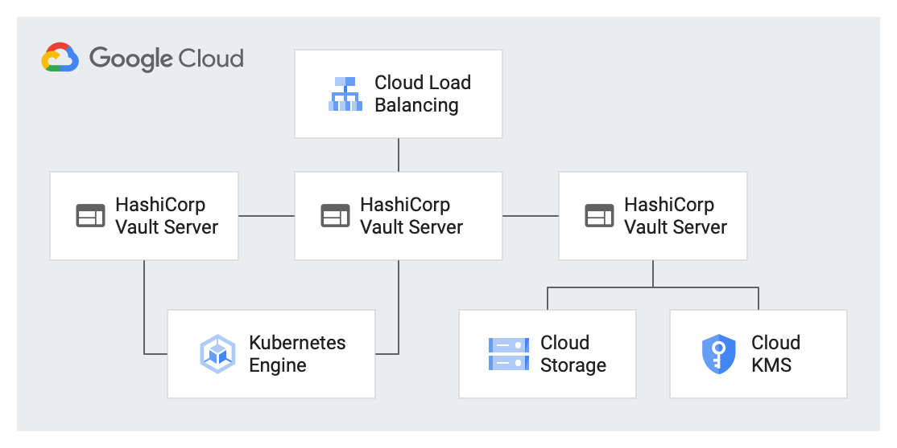

# Anthos security blueprint: Implementation steps for managing secrets

The deployment steps in [HashiCorp Vault with GKE on Terraform](https://github.com/sethvargo/vault-on-gke) provision
a highly available [HashiCorp Vault](https://www.vaultproject.io/) cluster on
[Google Kubernetes Engine](https://cloud.google.com/kubernetes-engine) using [HashiCorp Terraform](https://www.terraform.io/)
as the provisioning tool. The architecture that you deploy is shown in the following diagram:

To understand the features you will configure, see
[Anthos security blueprint: Managing secrets](https://cloud.google.com/architecture/blueprints/anthos-managing-secrets-blueprint).

You carry out the steps in the following sections using your local admin workstation.

**Important**: Before you follow the instructions in this file, make sure that you have
followed the setup steps in the `~/anthos-security-blueprints/README.md` file. This ensures that you have Terraform installed on your admin workstation.

## Install Vault locally

To use the Vault CLI from your admin workstation, you need to install Vault locally. The following instructions assume that you are able to run Docker locally.

1.  Install Vault into the `$HOME/bin` directory so that the Vault CLI is accessible between restarts of your admin workstation:

    `docker run -v $HOME/bin:/software sethvargo/hashicorp-installer vault 1.2.2`
    `sudo chown -R $(whoami):$(whoami) $HOME/bin/  `

2. Add the `bin` directory to your environment path:

     ` export PATH=$HOME/bin:$PATH `

## Provision Hashicorp Vault on GKE 

From your admin workstation, do the following:

1.  Clone the `https://github.com/sethvargo/vault-on-gke` repo.
2.  Ensure you have  access to your organization ID and billing ID.
3.  In the local clone of the repo, follow the instructions in the
    [`README`](https://github.com/sethvargo/vault-on-gke/blob/master/README.md) file.
4.  Follow the  instructions to deploy Vault on a GKE cluster. This provisions the 
    following:
    -   A dedicated project
    -   A Cloud Storage bucket
    -   A service account with least privileges 
    -   A Cloud KMS key for sealing and unsealing
    -   A GKE cluster with the service account assigned
    -   A public IP address
    -   A self-signed certificate authority (CA)
    -   A self-signed certificate signed by the CA

## Activate the Google Cloud secrets engine

The [Hashicorp Google Cloud secrets engine](https://www.vaultproject.io/docs/secrets/gcp) lets you dynamically generate Google Cloud service account keys and OAuth tokens based on IAM policies.

From your admin workstation, do the following:

1.  To enable the Google Cloud secrets engine, follow the instructions in the
[Hashicorp documentation](https://www.vaultproject.io/docs/secrets/gcp).

## Activate Google Cloud KMS secrets engine

The [Hashicorp Google Cloud KMS secrets engine](https://www.vaultproject.io/docs/secrets/gcpkms) adds a further layer of security  by using [Cloud KMS](https://cloud.google.com/kms/)
to encrypt secrets at the [application layer](https://cloud.google.com/gke-on-prem/docs/how-to/security/kubernetes-engine/docs/how-to/encrypting-secrets).

From your admin workstation, do the following: 

1.  To enable the Google Cloud KMS engine, follow the instructions in the
    [Hashicorp documentation](https://www.vaultproject.io/docs/secrets/gcpkms).