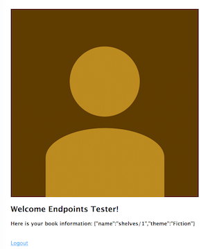

# Google Cloud Endpoints Auth0 Node.js Client

This is a fork of
[nodejs-regular-webapp](https://github.com/auth0/node-auth0/tree/03727f3cfdffcb219c28cc9f3933371862654da4/examples/nodejs-regular-webapp).
Please see `makeRequest()` in `routes/user.js` for how to make a request to
Endpoints.

In order to run the example you need to have npm and Node.js installed. Also,
you'll need to be familiar with how to deploy the sample Node.js app, found in
{ROOT}/examples/nodejs/bookstore. See the README there for more details.

In the below instructions, we can use either a symmetric or an asymmetric Auth0 key.

## Initial Setup Instructions

Set up Auth0 for use with your app:

1. Go to http://auth0.com, register for an account and create an app.
2. In the app settings, change the Allowed Callback URL to
   `http://localhost:3000/callback`.
3. If you are using asymmetric key encryption, in the app settings
   page, under advanced configuration, under OAuth, set the
   'JsonWebToken Token Signature Algorithm' to RS256. By default this
   should be set to HS256 which is what you need for symmetric key
   encryption. Make sure to save your changes.

## Auth0 Symmetric key encryption Instructions

In order to set up your app to use Auth0 Symmetric key encryption, follow the
following steps:

1. In a web browser, navigate to the [Google Compute Engine Metadata
   Page](https://console.cloud.google.com/project/_/compute/metadata).
2. Select your project in the drop-down, then press Continue.
3. Click the Edit button, then click Add Item.
4. Enter `auth-symmetric-key` (or another unique name) as the metadata key.
5. Enter your Auth0 Client Secret, which was also found on your Auth0 app
   settings page, as the value.
6. Click Save.
7. Replace the contents of `swagger.json` in your backend's directory with the
   contents of `{ROOT}/examples/swagger/bookstore/swagger-auth0-symmetric.json`.
   You may choose to backup the existing `swagger.json` if you want to restore
   it later.
8. In the newly-copied Swagger config in your backend's directory, make the following modifications:
    1. In the `host` field, replace MY_PROJECT_ID with your Google project's ID.
    2. Find the `securityDefinitions` > `auth0_symmetric` section.
    3. There, alter the `authorizationUrl` field by replacing `esp-symmetric.auth0.com` with your
       own Auth0 domain, keeping `/authorize` after it.
    4. Similarly, change `x-issuer` with your Auth0 domain.
    5. Change `x-jwks_uri` to match the following:
       `http://169.254.169.254/computeMetadata/v1/project/attributes/YOUR_METADATA_KEY`
       Replace `YOUR_METADATA_KEY` with the 'auth-symmetric-key' key (or other unique key) which
       you created in step (4) above.
    6. Finally, replace the `x-security` > `auth0_symmetric` > `audiences` field with your Auth0 Client Id.
9. Redeploy your Node.js app by running `gcloud preview app deploy --promote`.

## Auth0 Asymmetric key encryption Instructions

In order to set up your app to use Auth0 Asymmetric key encryption, follow the
following steps:

1. Replace the contents of `swagger.json` in your backend's directory with the
   contents of `{ROOT}/examples/swagger/bookstore/swagger-auth0.json`.
   You may choose to backup the existing `swagger.json` if you want to restore
   it later.
2. In the newly-copied Swagger config in your backend's directory, make the following modifications:
    1. In the `host` field, replace MY_PROJECT_ID with your Google project's ID.
    2. Find the `securityDefinitions` > `auth0_jwk` section.
    3. There, alter the `authorizationUrl` field by replacing `esp-jwk.auth0.com` with your
       own Auth0 domain, keeping `/authorize` after it.
    4. Similarly, change `x-issuer` with your Auth0 domain.
    5. Do the same with `x-jwks_uri`, matching your Auth0 domain.
    6. Finally, replace the `x-security` > `auth0_jwk` > `audiences` field with your Auth0 Client Id.
3. Redeploy your Node.js app by running `gcloud preview app deploy --promote`.

## Run your Nodejs App.

1. From the `{ROOT}/third_party/examples/client/auth0` directory, edit `routes/user.js` and change
   `API_HOST` to match "https://{PROJECT_ID}.appspot.com".
2. Run `npm install`. You only need to do this once.
3. From the Auth0 app settings page, copy the Client Secret, Client ID
   and Domain to the `.env_symmetric` (or `.env_asymmetric`) files in
   this directory, matching each field to the appropriate environment
   variable.
4. Run `./start_client.sh -e .env_symmetric` or `./start_client.sh -e
   .env_asymmetric`. This will start a simple web server that listens
   on port 3000.
5. Open http://localhost:3000 to sign into Auth0 and automatically
   make an authenticated test request to Google Cloud Endpoints. If
   you see book information after authenticating, then your app is
   using Auth0!

Below is an example of the app after a successful request.

