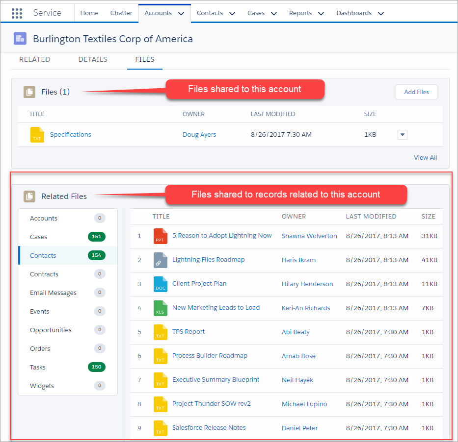
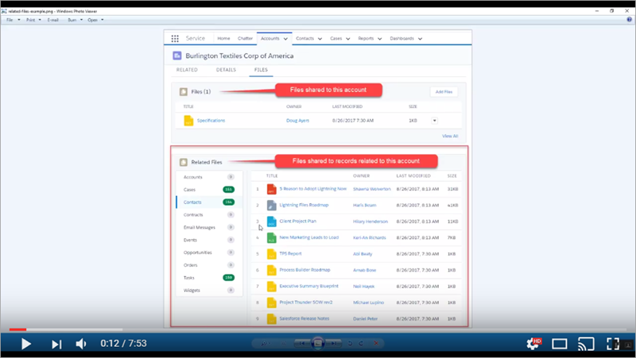
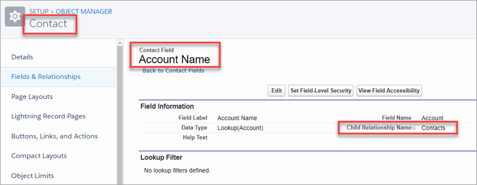
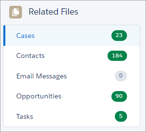

View Salesforce Files of Related Records
========================================

See files shared to all related records on one page in Lightning.

This project provides a Lightning Component you can drag on to your Lightning Record Pages in App Builder.

Background
----------

As of Summer '17 release, Lightning Files related list behaves fundamentally different than Classic Notes & Attachments related list
when it comes to showing files and attachments shared to not only to the current record but also shared to related child records.

When viewing the **Classic Notes & Attachments** related list on an account, for example, attachments belonging to the account
and its related contacts, cases, opportunities, tasks, etc. **are displayed** in one combined list.

When viewing the **Lightning Files** related list on the same account, for example, only the files explicitly shared to the account
are displayed. The files shared to its related contacts, cases, opportunities, tasks, etc. **are not displayed** in the same combined list.

This is a known limitation and by design according to this [help article](https://help.salesforce.com/articleView?id=000231874&type=1).

Community Requests
------------------

However, this "rollup" of Classic Attachments is a much beloved feature and customers are asking for it in Lightning Experience.

[Keri-An Richards](https://www.linkedin.com/in/keri-an-richards-44270810/) took to the IdeaExchange and submitted
[Roll up display of Notes and Attachments in Lightning as it was in Classic](https://success.salesforce.com/ideaView?id=08730000000cHYhAAM).

Others, like [Abi Beaty](https://success.salesforce.com/_ui/core/chatter/groups/GroupProfilePage?g=0F93A0000009SE1&fId=0D53A000037sJDC)
and [Hilary Henderson](https://success.salesforce.com/_ui/core/chatter/groups/GroupProfilePage?g=0F93A0000009SE1&fId=0D53A00003Bs5Tk),
have also inquired on the Success Community how to get this rollup feature in Lightning.

Seeing a need I began developing this app. After [sharing a sneak peek](https://twitter.com/DouglasCAyers/status/900277146668728320) on Twitter,
[Haris Ikram](https://twitter.com/HarisIkramH), Product Manager for Salesforce, commented that such a solution is in demand and happy to share this with the Salesforce Lightning Team. 

---

Packaged Release History
------------------------

Release 1.1 (current release)
-----------
* Install package
  * [Production URL](https://login.salesforce.com/packaging/installPackage.apexp?p0=04t1I000000h81M)
  * [Sandbox URL](https://test.salesforce.com/packaging/installPackage.apexp?p0=04t1I000000h81M)
* Add support for custom lookup fields on Activities ([issue 2](https://github.com/DouglasCAyers/sfdc-related-files-lightning/issues/2))
* For Account records, files related to Tasks and Events that rollup to an Account are included (e.g. `Task.AccountId`, `Event.AccountId`) Example: Files related to a Task that is related to an Opportunity will be visible at the Account level. ([issue 3](https://github.com/DouglasCAyers/sfdc-related-files-lightning/issues/3)) 
* Child relationships are now case-insensitive in App Builder ([issue 5](https://github.com/DouglasCAyers/sfdc-related-files-lightning/issues/5))

Release 1.0 (current release)
-----------
* Initial managed package offering
* Shows all files, grouped by object, accessible by the user that are shared to related child records of the parent record.

Installing the Source Code (Developers)
---------------------------------------

You may install the unmanaged code from GitHub and make any desired adjustments. You are responsible for ensuring unit tests meet your org's validation rules and other requirements.

* [Deploy from Github](https://githubsfdeploy.herokuapp.com)

---

Getting Started
---------------

1. Setup [My Domain](https://help.salesforce.com/articleView?id=domain_name_overview.htm&type=0). My Domain is required to use Lightning Components. ([Trailhead Module](https://trailhead.salesforce.com/modules/identity_login/units/identity_login_my_domain))

2. Add the [Files related list](https://releasenotes.docs.salesforce.com/en-us/winter16/release-notes/rn_chatter_files_related_list.htm) to your Page Layouts ([Trailhead Module](https://trailhead.salesforce.com/en/modules/lex_customization/units/lex_customization_page_layouts))

3. Add the **Related Files** custom Lightning Component to your Lightning Record Pages ([Trailhead Module](https://trailhead.salesforce.com/en/modules/lightning_app_builder/units/lightning_app_builder_recordpage))

Check out this 7 minute setup and how-to video:

Recommendations
---------------

* This component only works with Lightning Files, if you are still using Classic Attachments then I recommend that you [migrate them](https://github.com/DouglasCAyers/sfdc-convert-attachments-to-chatter-files).
* Add a new tab on your Record Pages labeled "Files" then add the standard `Related List` component (configured to show the **Files** related list) and my custom `Related Files` component.

FAQ
===

If one of your questions isn't answered below, please search and comment on [existing issues](https://github.com/DouglasCAyers/sfdc-related-files-lightning/issues?utf8=%E2%9C%93&q=is%3Aissue) before opening a new one. Thanks! 

Which files are shown in the Lightning Component?
-------------------------------------------------

Files shared to child records that the user has access to.
A child record is any record found in one of the **related lists** of the main record being viewed.
For example, if viewing an account then the component could show you all files shared to contacts, cases, opportunities, etc. belonging to that account.

Specifically when viewing an account, files related to tasks and events that are related to child records of an account do rollup and are visible at the account level. This is possible because of the standard `Task.AccountId` and `Event.AccountId` fields and Salesforce populating them for account rollup behaviors.

As a System Administrator, you may customize which related lists are visible in this component.
By default, all relationships accessible by the current user are displayed in the vertical navigation.

How do I customize which related lists are shown in the vertical navigation?
----------------------------------------------------------------------------

In App Builder when editing the Record Page you added the **Related Files** lightning component,
there is a customization attribute named **Child Relationships**.
Enter a comma-delimited list of the API name(s) of the child relationships as defined on the lookup field on the child object.

For example, if on the Account page you wanted this component to show only files for Contacts and a custom object `Invoice__c`,
you might enter "`Contacts,Invoices__r`".

To determine a child relationship name, in Setup use Object Manager to navigate to your child object (e.g. `Contact` or `Invoice__c`)
then navigate to the lookup field that points to the parent object (that is the object whose Lightning Record Page you're adding this component).
On the field's detail page you'll see the field label, field name, and the child relationship name (use this value in App Bulider). If this is a custom lookup or master-detail field then [you will need to append `__r` to the child relationship name](https://github.com/DouglasCAyers/sfdc-related-files-lightning/issues/13).

What do the badge counts mean in the vertical navigation?
---------------------------------------------------------

The badge count is the number of **unique files** shared to those related records.

For example, if the single file "Hello.txt" is shared to 3 contacts related to the same account then
when viewing this **Related Files** lightning component on that account page would display the badge count 1
for the `Contacts` relationship even though 3 contacts exist because only 1 unique file was shared among them.

I don't see Attachments from related records like in Classic, what gives?
-------------------------------------------------------------------------

This component only works with Lightning Files, if you are still using Classic Attachments then I recommend that you [migrate them](https://github.com/DouglasCAyers/sfdc-convert-attachments-to-chatter-files).

Why is a child relationship name listed multiple times in the vertical navigation?
-----------------------------------------------------------------------------------

See issue [Use Actual Related List Labels](https://github.com/DouglasCAyers/sfdc-related-files-lightning/issues/1).

Why do the child relationship labels in the vertical navigation not match the labels of the related lists on the page layout?
-----------------------------------------------------------------------------------------------------------------------------

See issue [Use Actual Related List Labels](https://github.com/DouglasCAyers/sfdc-related-files-lightning/issues/1).

---

Disclaimer
=========

I have only tested this in a Developer Edition org with a few hundred related records and files off one account.
If you have a much larger org with thousands of related records and files, please let me know how performance is
so I can make any adjustments if needed. Thanks!

Credits
=======

[Doug Ayers](https://douglascayers.com) develops and maintains the project.

License
=======

The source code is licensed under the [BSD 3-Clause License](LICENSE)
