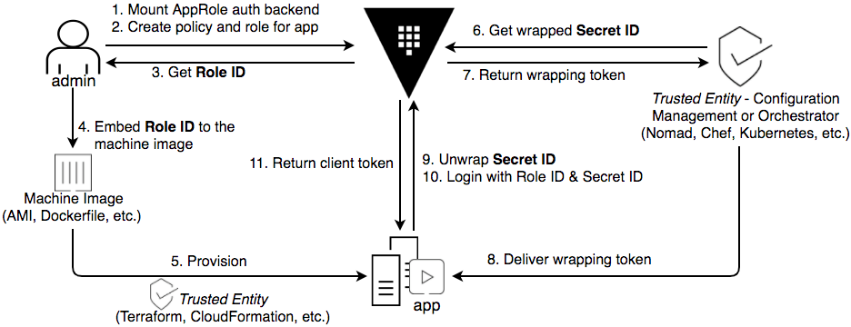

To login, you must pass the role ID (`role_id.txt`{{open}}) and secret ID (`secret_id.txt`{{open}}):

```
vault write auth/approle/login role_id=<role_ID> secret_id=<secret_ID>
```

Now, let's log in using the `approle` auth method and store the generated client token in a file named, `app_token.txt`:

```
vault write -format=json auth/approle/login \
      role_id=$(cat role_id.txt) secret_id=$(cat secret_id.txt) \
      | jq -r ".auth.client_token" > app_token.txt
```{{execute T1}}

Examine the generated token's properties:

```
vault token lookup $(cat app_token.txt)
```{{execute T1}}

The token has read-only permission on the `secret/myapp/*` path.

```
vault kv get secret/myapp/db-config
```{{execute T1}}

## Summary

In a real-world, you do not want to send the role ID and secret ID together over the network. The typical use case is to use two different mechanisms to deliver the role ID and secret ID separately to the expecting client.



To learn more, refer to the [AppRole with Terraform & Chef](https://learn.hashicorp.com/vault/identity-access-management/iam-approle-trusted-entities) guide which uses Terraform to inject the Role ID as an environment variable, and Chef to pull the Secret ID from Vault.
