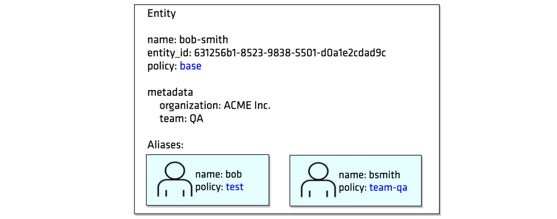

Execute the following command to discover the mount accessor for the `userpass` auth method since `bob` and `bsmith` are users defined using the `userpass` auth method:

```
vault auth list \
    -format=json | jq -r '.["userpass/"].accessor' > accessor.txt
```{{execute T1}}

This command parses the output using `jq`, retrieves the mount accessor for `userpass` and save it in the `accessor.txt`{{open}} file.

**NOTE:** The output of `vault auth list -detailed`{{execute T1}} includes the accessor ID for each auth method enabled on your Vault server. For example, if LDAP and Okta auth methods were enabled on your server, the output includes the accessor ID for those methods:

```
Path         Type        Accessor                  ...
----         ----        --------                  ...
ldap/        ldap        auth_ldap_a764f919        ...
okta/        okta        auth_okta_0e2bffe6        ...
token/       token       auth_token_070a4d9f       ...
userpass/    userpass    auth_userpass_329e028b    ...
```
If the identity, `bob`, is defined in LDAP and `bsmith` is defined in Okta, you would need the accessor IDs of LDAP and Okta.

<br>
## Create bob-smith Entity



Execute the following command to create a new entity named, `bob-smith` and save its ID in the `entity_id.txt` file:

```
vault write -format=json identity/entity name="bob-smith" \
     policies="base" \
     metadata=organization="ACME Inc." \
     metadata=team="QA" \
     | jq -r ".data.id" > entity_id.txt
```{{execute T1}}

> Note that the metadata are passed in `metadata=<key>=<value>` format. In the above command, the entity has organization and team as its metadata.


Now, add user `bob` to the `bob-smith` entity by creating an entity alias:

```
vault write identity/entity-alias name="bob" \
     canonical_id=$(cat entity_id.txt) \
     mount_accessor=$(cat accessor.txt)
```{{execute T1}}

> **NOTE:**  If you don't specify the `canonical_id` value, Vault automatically creates a new entity for this alias.  


Repeat the step to add user bsmith to the `bob-smith` entity.

```
vault write identity/entity-alias name="bsmith" \
     canonical_id=$(cat entity_id.txt) \
     mount_accessor=$(cat accessor.txt)
```{{execute T1}}


Execute the following command to read the entity details:

```
vault read identity/entity/id/$(cat entity_id.txt)
```{{execute T1}}


The output should include the entity aliases (both `bob` and `bsmith`), metadata (organization, and team), and base policy.

**NOTE:** It might be easier to read the output in JSON format.

```
vault read -format=json identity/entity/id/$(cat entity_id.txt)
```{{execute T1}}
